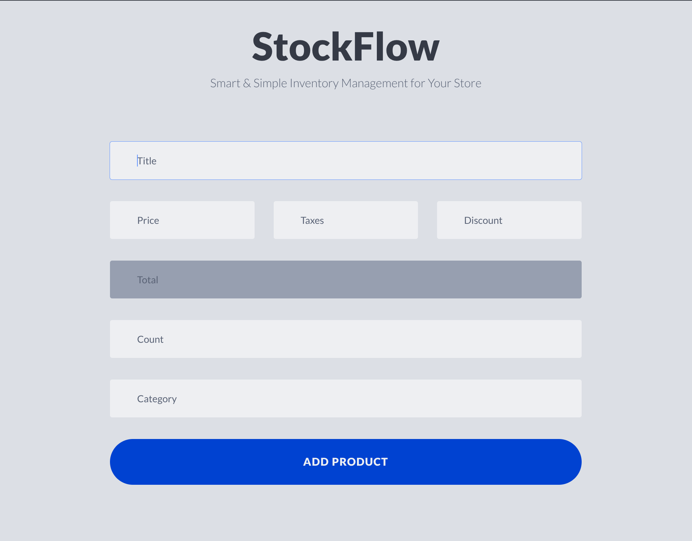

# StockFlow - Smart & Simple Inventory Management

StockFlow is a lightweight inventory management system designed to help store owners efficiently add, update, search, and delete products while keeping track of taxes, discounts, and totals.



## 📌 Features
### 🔹 Product Management
- **Add Products →** Enter product details (`title`, `price`, `taxes`, `discount`, `category`) and add multiple items at once.
- **Update Products →** Modify product details and save changes without creating duplicates.
- **Delete Products →** Remove a single product or clear all products with one click.
- **Persistent Storage →** All products are stored in `local storage`, so they remain available even after a page refresh.

### 🔹 Dynamic Price Calculation
- **Auto-calculate the total price** based on `price`, `taxes`, and `discount`.
- **Live total update** as you type values in the input fields.

### 🔹 Smart Input Validation
- **Real-time validation →** Ensures required fields (`title`, `price`, `category`) are not empty.
- **Instant feedback →** Highlights missing or incorrect fields to prevent invalid product entries.

### 🔹 Search & Filtering
- **Live Search →** Quickly find products using the search bar.
- **Filter by Title or Category →** Search updates in **real-time** as you type.

### 🔹 User Experience Enhancements
- **Update Mode UI →** When updating a product, the form changes state and scrolls into view smoothly.
- **Disables Deletion During Update →** Prevents accidental deletion while modifying a product.
- **Scroll-to-Top Button →** Appears when scrolling down for quick navigation back to the top.

### 🔹 Responsive & Accessible
- **Works on all modern browsers** without additional setup.
- **Keyboard-friendly →** Autofocus on the first input field when the page loads.

## 📖 How to Use
### 1️⃣ Add a Product
1. Enter product details (`title`, `price`, `taxes`, `discount`, and `category`).
2. Click **"Add Product"**.
3. The product will be **stored in local storage** and displayed in the list.

### 2️⃣ Update a Product
1. Click the **"Update"** button next to a product.
2. Modify the details.
3. Click **"Update Product"** to save changes.

### 3️⃣ Search for a Product
- Use the search bar and select **search by title** or **search by category**.
- The list updates **instantly** as you type.

### 4️⃣ Delete a Product
- Click the **"Delete"** button on a specific product to remove it.
- Click **"Delete All"** to remove all products.

## 🔗 Live Demo

🎯 Experience StockFlow in Action!

🌐 Live Link: [StockFlow](https://belmqadem.github.io/StockFlow/)

⚡ No Installation Needed → Just click the link and explore!

## 🚀 Forking the Project & Adding Features
Want to contribute? Follow these steps:

1. Fork the Repository
Click the **"Fork"** button in the top-right of the repository page.

2. Clone Your Fork Locally
```sh
git clone https://github.com/your-username/StockFlow.git
cd StockFlow
```

3. Create a New Branch

```sh
git checkout -b your-branch-name
```

4. Make Your Changes
Modify the code, add new features, and test them in your browser.

5. Commit Your Changes
```sh
git add .
git commit -m "Added a new feature: your-feature-name"
```

6. Push Your Changes to Your Fork
```sh
git push origin your-branch-name
```

7. Submit a Pull Request (PR)
	- Click **"New Pull Request"** and select your branch.
	- Add a clear description of your changes and submit the PR.

## 🙌 Contributing
Contributions are always welcome! If you have ideas for new features or bug fixes, feel free to **open an issue** or **submit a pull request**.

For major changes, please open a discussion first to ensure compatibility with the project.

## 📞 Contact
- Email: adilbelmqadem4@gmail.com
- LinkedIn: [Adil Belmqadem](https://www.linkedin.com/in/adilbelmqadem/)
